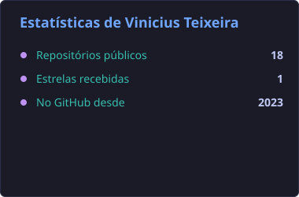
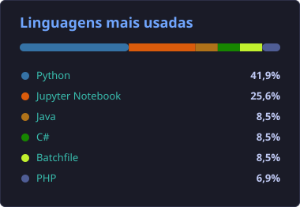

# 📙 Vinicius Teixeira

**`Estudante`**

Olá

Me chamo Vinicius Teixeira, tenho 26 anos e sou de Campinas, interior de São Paulo. Sou formado em Técnico em Mecânica pelo Senai e em Técnico em Eletroeletrônica pelo Cotuca. Atualmente, estou cursando Gestão da Tecnologia da Informação na Faculdade de Tecnologia de Campinas – FATEC.

---

### 📊 Estatísticas

  
  

Cards gerados automaticamente por uma GitHub Action e servidos pelo próprio repositório.
